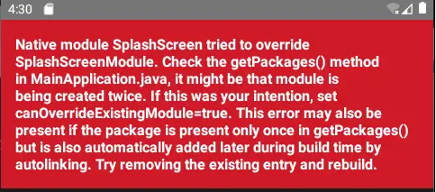
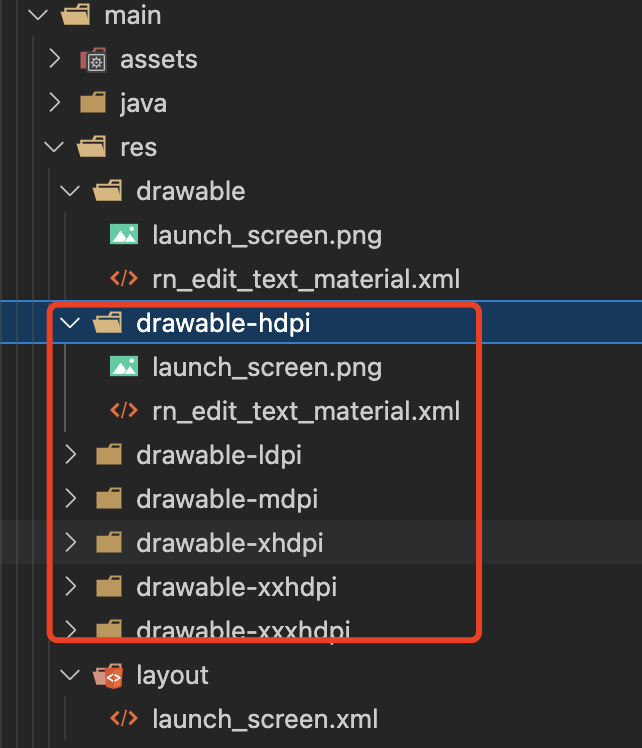

# `React Native` 小白安卓开发历险记

从0开始，使用 `React Native` 进行 `android` 程序开发。此文主要记录开发过程中踩过的一些坑和一些开发注意事项。因为并没有适配 `IOS` 机型，所有这里均不考虑 `IOS` 系统兼容问题。
有机会刷完 `IOS` 副本，再做记录。

## 启动屏设置之 `react-native-splash-screen`

[仓库地址](https://github.com/crazycodeboy/react-native-splash-screen)

首先按照文档进行安装使用 (android)

- 第一步 `npm i react-native-splash-screen --save` 安装相关 `NPM` 包

- 第二步 在 `android/app/build.gradle` 文件中, 将 `:react-native-splash-screen` 项目添加为编译时依赖项：
  
```
...
dependencies {
    ...
    implementation project(':react-native-splash-screen')
}
```

- ⚠️ 第三步 注意此处有坑！！！按照官方文档的步骤，会让我们在 `MainApplication` 中注册该包，然后在后面的步骤都完成之后，程序启动正常。BUT！！！

到启动屏关闭之后就出现惊悚的血红色背景和苍白的错误文案：



简单解释下就是，我们获取插件的方法在 `MainApplication` 中重写了两次，该 `Android` 包已经在 `PackageList` 中了，所以就不需要再自己手动添加注册包了。所以这里就可以省略掉文档中在`MainApplication` 文件中注册的操作了。（猜测可能是版本更新导致已经自动注册了～）

- 第四步 开始配置插件, 通过更改 `MainActivity.java` 使用 `react-native-splash-screen`
  
``` java
import android.os.Bundle; // here
import com.facebook.react.ReactActivity;
// react-native-splash-screen >= 0.3.1
import org.devio.rn.splashscreen.SplashScreen; // here
// react-native-splash-screen < 0.3.1
import com.cboy.rn.splashscreen.SplashScreen; // here

public class MainActivity extends ReactActivity {
   @Override
    protected void onCreate(Bundle savedInstanceState) {
        SplashScreen.show(this);  // here
        super.onCreate(savedInstanceState);
    }
    // ...other code
}
```

- 第五步 插件使用, 创建一个名为 `launch_screen.xml` 的文件在 `app/src/main/res/layout`（`layout`如果不存在则创建 - 文件夹）。文件的内容应如下所示：
  
``` xml
<?xml version="1.0" encoding="utf-8"?>
<RelativeLayout xmlns:android="http://schemas.android.com/apk/res/android"
  android:orientation="vertical" android:layout_width="match_parent"
  android:layout_height="match_parent">
  <ImageView android:layout_width="match_parent" android:layout_height="match_parent" android:src="@drawable/launch_screen" android:scaleType="centerCrop" />
</RelativeLayout>
```

通过创建一个 `launch_screen.png` 文件并将其放在适当的 `drawable` 文件夹中来自定义您的启动屏幕。`Android` 会自动缩放可绘制对象，因此您不必为所有手机密度提供图像。

这是文档的原话，但是注意这里不仅仅只是创建一个文件夹，需要根据不同尺寸手机创建对应的文件夹（如下图所示,文件夹内文件类型相同），如果只创建设置了 `drawable`文件夹及内容，打包出来后少部分手机会直接打不开程序，作者亲身经历此坑！所以文件配置一定要全！！！



然后添加一个名为`primary_dark`的颜色在 `app/src/main/res/values/colors.xml` 文件中

``` xml
<?xml version="1.0" encoding="utf-8"?>
<resources>
    <color name="primary_dark">#000000</color>
</resources>
```

最后在适合的时机，在代码中把开屏图片隐藏即可

``` js
import SplashScreen from 'react-native-splash-screen'

export default class WelcomePage extends Component {

    componentDidMount() {
    	// do stuff while splash screen is shown
        // After having done stuff (such as async tasks) hide the splash screen
        SplashScreen.hide();
    }
}
```

其他额外配置可以查看[原文档](https://github.com/crazycodeboy/react-native-splash-screen)配置


## 打包的`apk` `http`请求无效

开发调试的时候网络请求都没有问题，但是打包成 `apk` 安装后，接口请求都无法请求成功。查了资料以后发现，是因为 `android` 系统默认禁止访问不安全的请求，比如http导致的。
