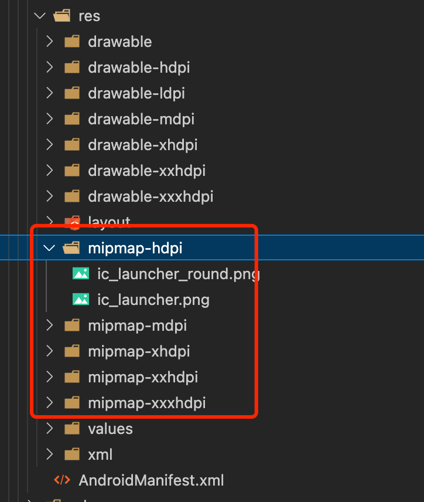
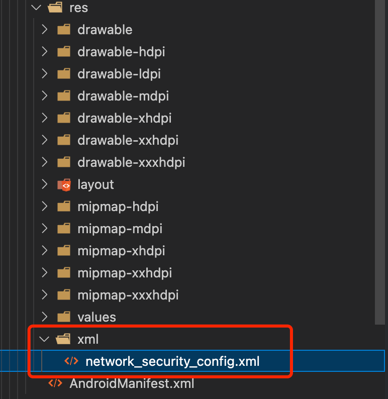
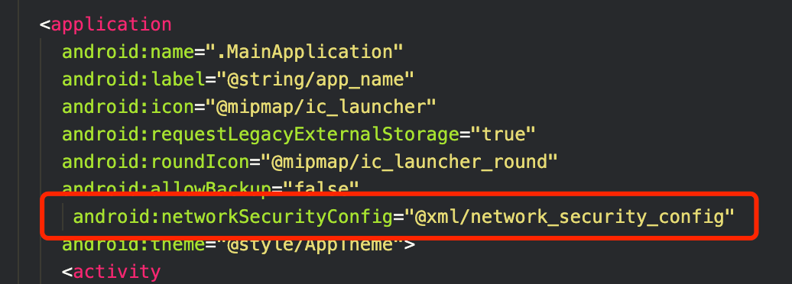

# `React Native` 小白安卓开发历险记

从0开始，使用 `React Native` 进行 `android` 程序开发。此文主要记录开发过程中踩过的一些坑和一些开发注意事项。因为并没有适配 `IOS` 机型，所有这里均不考虑 `IOS` 系统兼容问题。
有机会刷完 `IOS` 副本，再做记录。

## 设置APP名称、logo图标

应用程序的名称默认是使用 `react-native-cli` 创建项目时的名称。修改的方式很简单，找到相应的配置然后修改即可。

### 修改名称

编辑 `android/app/src/main/res/values/strings.xml` 文件：

``` xml
<resources>
-    <string name="app_name">test</string>
+    <string name="app_name">测试程序</string>   
</resources>
```

### 修改应用图标

我们直接用生成好的内容替换默认的图标即可。图标位置在 `android/app/src/main/res` 文件夹下，应用图标需要设置不同尺寸，如果所示：



## 启动屏设置之 `react-native-splash-screen`

[仓库地址](https://github.com/crazycodeboy/react-native-splash-screen)

首先按照文档进行安装使用 (android)

- 第一步 `npm i react-native-splash-screen --save` 安装相关 `NPM` 包

- 第二步 在 `android/app/build.gradle` 文件中, 将 `:react-native-splash-screen` 项目添加为编译时依赖项：
  
```
...
dependencies {
    ...
    implementation project(':react-native-splash-screen')
}
```

- ⚠️ 第三步 注意此处有坑！！！按照官方文档的步骤，会让我们在 `MainApplication` 中注册该包，然后在后面的步骤都完成之后，程序启动正常。BUT！！！

到启动屏关闭之后就出现惊悚的血红色背景和苍白的错误文案：


简单解释下就是，我们获取插件的方法在 `MainApplication` 中重写了两次，该 `Android` 包已经在 `PackageList` 中了，所以就不需要再自己手动添加注册包了。所以这里就可以省略掉文档中在`MainApplication` 文件中注册的操作了。（猜测可能是版本更新导致已经自动注册了～）

- 第四步 开始配置插件, 通过更改 `MainActivity.java` 使用 `react-native-splash-screen`
  
``` java
import android.os.Bundle; // here
import com.facebook.react.ReactActivity;
// react-native-splash-screen >= 0.3.1
import org.devio.rn.splashscreen.SplashScreen; // here
// react-native-splash-screen < 0.3.1
import com.cboy.rn.splashscreen.SplashScreen; // here

public class MainActivity extends ReactActivity {
   @Override
    protected void onCreate(Bundle savedInstanceState) {
        SplashScreen.show(this);  // here
        super.onCreate(savedInstanceState);
    }
    // ...other code
}
```

- 第五步 插件使用, 创建一个名为 `launch_screen.xml` 的文件在 `app/src/main/res/layout`（`layout`如果不存在则创建 - 文件夹）。文件的内容应如下所示：
  
``` xml
<?xml version="1.0" encoding="utf-8"?>
<RelativeLayout xmlns:android="http://schemas.android.com/apk/res/android"
  android:orientation="vertical" android:layout_width="match_parent"
  android:layout_height="match_parent">
  <ImageView android:layout_width="match_parent" android:layout_height="match_parent" android:src="@drawable/launch_screen" android:scaleType="centerCrop" />
</RelativeLayout>
```

通过创建一个 `launch_screen.png` 文件并将其放在适当的 `drawable` 文件夹中来自定义您的启动屏幕。`Android` 会自动缩放可绘制对象，因此您不必为所有手机密度提供图像。

这是文档的原话，但是注意这里不仅仅只是创建一个文件夹，需要根据不同尺寸手机创建对应的文件夹（如下图所示,文件夹内文件类型相同），如果只创建设置了 `drawable`文件夹及内容，打包出来后少部分手机会直接打不开程序，作者亲身经历此坑！所以文件配置一定要全！！！


然后添加一个名为`primary_dark`的颜色在 `app/src/main/res/values/colors.xml` 文件中

``` xml
<?xml version="1.0" encoding="utf-8"?>
<resources>
    <color name="primary_dark">#000000</color>
</resources>
```

最后在适合的时机，在代码中把开屏图片隐藏即可

``` js
import SplashScreen from 'react-native-splash-screen'

export default class WelcomePage extends Component {

    componentDidMount() {
    	// do stuff while splash screen is shown
        // After having done stuff (such as async tasks) hide the splash screen
        SplashScreen.hide();
    }
}
```

其他额外配置可以查看[原文档](https://github.com/crazycodeboy/react-native-splash-screen)配置


## 打包的`apk` `http`请求无效

开发调试的时候网络请求都没有问题，但是打包成 `apk` 安装后，接口请求都无法请求成功。查了资料以后发现，是因为 `android` 系统默认禁止访问不安全的请求，比如http导致的。

### 解决方案

#### 方法一是直接使用 `https` 进行数据请求

#### 方法二是进行一些配置 使 `app` 可以进行 `http` 进行数据请求

首先在 `res` 下新增加一个 `xml` 目录，然后创建一个名为 `network_security_config.xml` 文件,如图：



文件内容如下

``` xml
<?xml version="1.0" encoding="utf-8"?>
<network-security-config>
    <base-config cleartextTrafficPermitted="true" />
</network-security-config>
```

然后在 `androidManifiest.xml` 文件中添加 `android:networkSecurityConfig="@xml/network_security_config"`



最后重新打包就可以了

## 关于 `Ant Design Mobile RN`

关于在 ` React native ` 中使用 `Ant Design Mobile RN` 注意事项。

首先我的程序使用 `react-native-cli` 脚手架搭建，安装使用 `Ant Design Mobile RN` 组件库的时候，因为按需样式引入问题，最终使用的是 `babel-plugin-import` 方案进行按需加载。

但是在组件使用的过程中还是有些组件会有问题，最终用的还是 `react native` 官方封装的组件。所以这里强烈建议能用官方提供的组件尽量使用官方的。

## 项目开发注意事项

### 样式编写相关

RN 在编写的样式的时候，关于元素的长宽虽然RN已经做过处理，我们直接写数字就行，但是我在开发时，在不同机型上还是会有差异，有时甚至有些时候会直接影响布局。所以建议尽量使用 `flex` 做自适应的布局。

其次就是 `css` 样式是不支持的，例如，渐变色和背景图片的设置都需要通过特殊的方法进行设置；

- 背景图片
  
  可以通过官方封装的组件 `ImageBackground`,但是这里我在开发的时候遇到了一个问题，就是在使用背景图的时候要想图片完全展示就需要根据图片设置元素的尺寸。但是上面也说了各种机型对宽高的解析还是会有差异，这就导致一些情况下有些机型样式会有问题。暂时也没找到好的解决方案，只能把背景图当作图片定位到容器里，然后根据容器自适应宽度。

- 渐变色
  
  通过 `react-native-linear-gradient` 工具库解决

然后在开发页面的时候当页面内容太长 `app` 页面并不会因为内容超出一屏还能滚动，结果是其他部分直接看不到，并且不能滚动页面，这里需要注意，跟web开发有很大区别。需要使用滚动视图 `ScrollView ` 解决。

### 关于页面路由

我使用的是 `React Navigation 6` 使用上基本没遇到什么问题，但是有一点需要注意。默认情况下，当组件卸载时 `React` 会自动调用 `useEffect` 函数中返回的函数。但是在 `React Navigation`中使用时，由于页面之间的切换并不会导致组件的卸载和挂载，因此 `useEffect` 函数不会被触发。

为了解决这个问题，你可以使用 `React Navigation` 提供的 `useIsFocused` 钩子函数来判断当前页面是否处于焦点状态。只有当前页面处于焦点状态时，才需要执行 `useEffect` 函数。

``` js
import { useIsFocused } from '@react-navigation/native';

function MyComponent() {
  const isFocused = useIsFocused();

  useEffect(() => {
    // 执行一些副作用
    return () => {
      // 清除副作用
    }
  }, []);

  useEffect(() => {
    if (!isFocused) {
      // 页面失去焦点，清除副作用
    }
  }, [isFocused]);

  // 其他代码...
}
```
