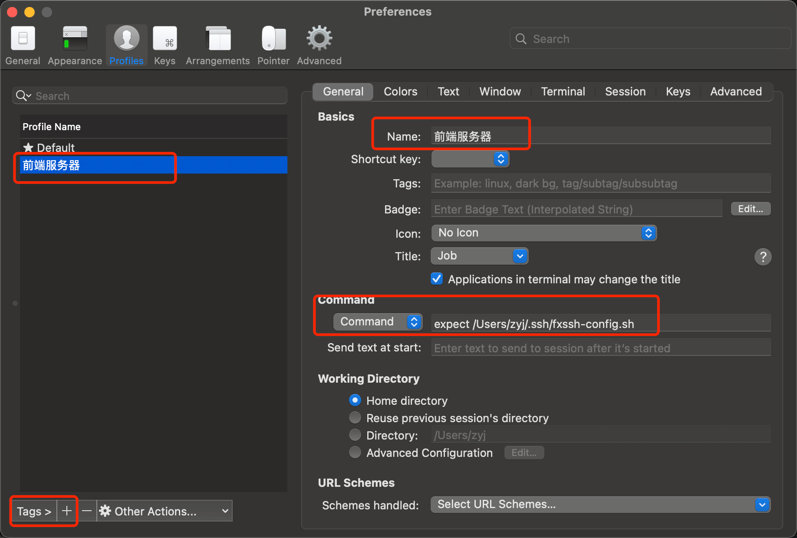

# 使用 `iTerm2 Profiles` 快捷登录 `ssh`

以前每次链接远程服务器的时候都是通过命令行，然后输入密码进行登录链接，每次链接都要重复这个步骤显得十分的麻烦。所以找到了 `iTerm2 Profiles` 的功能进行快捷登录。

``` sh
# 用户名（root或其他已有用户）登录远程服务器
ssh root@118.**.**.18
#  指定端口（88）
ssh -p 88 zhuyuanji@118.**.**.18
```

## 检查版本

检查是否安装好(显示安装好的版本号就是已经安装好了)

``` sh
expect -v
# expect version 5.45
```

## 填写 `iTerm2` 的配置文件

首先找到 `iTerm2`，然后选择 `Preferences`，点击 `+` 添加新的 `General` 配置，配置基础 `Name`，如有需要可以添加一个新的 `Tags`，然后在 `Commond` 中，设置 `expect` 的执行文件，可以在任意文件夹下的任意一个文件，随便任意指定。



## 创建指定的配置文件

首先进入到指定的文件夹中，并创建对应的配置文件(这里是`***.sh`文件)，并添加文件内容，如下：

``` sh
#!/usr/bin/expect
set HOST 118.18.18.188
set port 1818
set USER zhuyuanji
set PASSWORD 8*******8
 
spawn ssh -p $port $USER@$HOST
expect {
        "yes/no" {send "yes\r";exp_continue;}
         "*password:*" { send "$PASSWORD\r" }
        }
interact
```

### 基础命令解析

``` sh
# 设置超时时间,默认超时时间10s.
set timeout 
# spawn后面接的是我们要执行的shell命令
spawn shell command
# 匹配输出内容“hi”
# 匹配到内容''hi"后输出“hello”，“\r”是代表是返回字符。
expect "hi"
{send “hello\r”}
# 执行完成后保持交互状态，把控制权交给控制台，这个时候就可以手工操作了。如果没有这一句登录完成后会退出，而不是留在远程终端上。如果你只是登录过去执行一段命令就退出，可改为［expect eof］          
　　interact     　　　　　
```

### 连接方式

- 直接点击 `Profiles` 菜单，就能看到新的配置，直接点击就可以自动连接了。
- 在终端界面，直接右键，New Tab 选中即可~
- 快捷键操作，command+o ，选择你设定的Profile即可。
- 或者设在设置 `Profiles` 的时候设置 `Shortcut key` 快捷键选项

### 其他 `expect` 脚本示例

#### 简单更改密码脚本

``` sh
[root@localhost shell]# cat password.exp
#!/usr/bin/expect -d                  
#"#!/usr/bin/expect"这一行告诉操作系统脚本里的代码使用那一个shell来执行。 -d 启用调试模式(可加可不加)。

#设置超时时间为30s
set timeout 30  　　　　　　　　　　　　
#spawn是进入expect环境后才可以执行的expect内部命令，如果没有装expect或者直接在默认的SHELL下执行是找不到spawn命令的。所以不要用 “which spawn“之类的命令去找spawn命令。好比windows里的dir就是一个内部命令，这个命令由shell自带，你无法找到一个dir.com 或 dir.exe 的可执行文件。它主要的功能是给ssh运行进程加个壳，用来传递交互指令。
spawn passwd user5　　　
#这个命令的意思是判断上次输出结果里是否包含“New password:”的字符串，如果有则立即返回"123456","\r"代表是返回字符，否则就等待一段时间后返回，这里等待时长就是前面设置的30秒　　　　　　　
expect "New password:" {send "123456\r" } 
#在平常我们设置密码的时候会让我输入一次后再输入一次进行确认，这个是匹配第二次输出，然后再次输入密码。
expect "new password:" {send "123456\r"} 
#表示读取到文件结束符
expect eof　　　　　　　　　　　　　
```

#### 登陆远程服务器并停留在远程服务器上

``` sh
[root@localhost shell]# cat login.exp 
#!/usr/bin/expect
spawn ssh 192.168.123.218   #ssh 远程登陆
expect {
"*yes/no" {send "yes\r";exp_continue} #匹配输出内容，返回内容，exp_continue表示继续执行下一步
"*password" {send "123456\r"}
}
interact #执行完成后保持交互状态，把控制权交给控制台，这个时候就可以手工操作了。如果没有这一句登录完成后会退出，而不是留在远程终端上。如果你只是登录过去执行一段命令就退出，可改为［expect eof］
```

#### 传输参数执行登陆

``` sh
[root@localhost shell]# cat  login2.exp 
#!/usr/bin/expect 
set ip [lindex $argv 0]  #这条命令是将变量ip的值设置为传入进来的第一个参数。[lindex $argv 0]表示的就是第一个参数的值
set port [lindex $argv 1] #这条命令是将变量port的值设置为传入进来的第二个参数。[lindex $argv 1]表示的就是第二个参数的值
set passwd "123456"
spawn ssh $ip -p$port  #使用变量，这里使用的方法跟shell脚本一样
expect {
    "yes/no" {send "yes\r";exp_continue}
    "password:" {send "$passwd\r"}
}
interact
[root@localhost shell]# ./login2.exp  192.168.123.218 22 #多个参数直接以空格间隔，第一个参数：192.168.123.218 第二个参数22
```