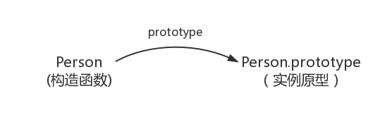
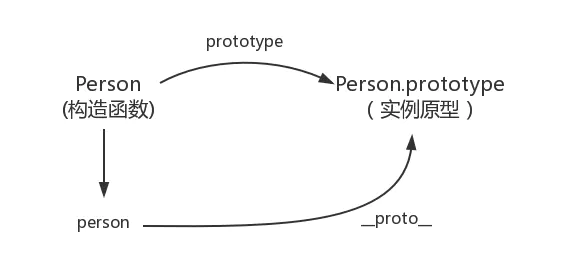
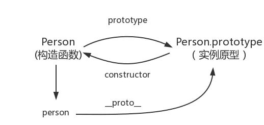
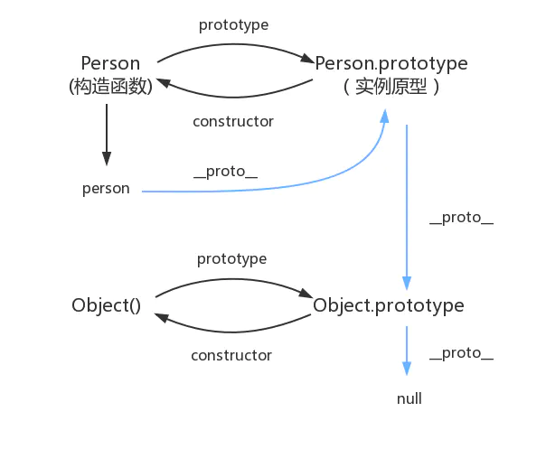
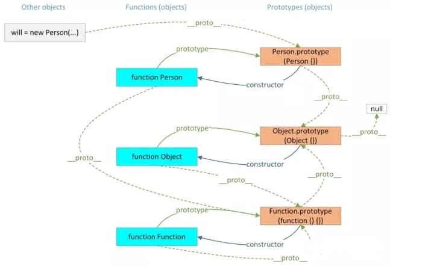

# `JavaScript`原型、原型链

早期的 ``JavaScript`` 程序员一般都有过使用 `JavaScript` “模拟面向对象”的经历。 然而 ``JavaScript`` 本身就是面向对象的，它并不需要模拟，只是它实现面向对象的方式和主流的流派不太一样，所以才让很多人产生了误会。 那么，随着我们理解的思路继续深入，这些“模拟面向对象”，实际上做的事情就是“模拟基于类的面向对象”。但是 `JavaScript` 这样的半吊子模拟，缺少了继承等关键特性，导致大家试图对它进行修补，进而产生了种种互不相容的解决方案。 

庆幸的是，从 `ES6` 开始，`JavaScript` 提供了 `class` 关键字来定义类，尽管，这样的方案仍然是基于原型运行时系统的模拟，但是它修正了之前的一些常见的“坑”， 统一了社区的方案，这对语言的发展有着非常大的好处。 实际上，我认为“基于类”并非面向对象的唯一形态，如果我们把视线从“类”移开，``Brendan`` 当年选择的原型系统，就是一个非常优秀的抽象对象的形式。 我们从头讲起。

## 什么是原型？
原型是顺应人类自然思维的产物。中文中有个成语叫做“照猫画虎”，这里的猫看起来就是虎的原型，所以，由此我们可以看出，用原型来描述对象的方法可以说是古已有之。

在不同的编程语言中，设计者也利用各种不同的语言特性来抽象描述对象。 最为成功的流派是使用“类”的方式来描述对象，这诞生了诸如 `C++`、`Java` 等流行的编程语言。这个流派叫做基于类的编程语言。 还有一种就是基于原型的编程语言，它们利用原型来描述对象。我们的 `JavaScript` 就是其中代表。 

“基于类”的编程提倡使用一个关注分类和类之间关系开发模型。在这类语言中，总是先有类，再从类去实例化一个对象。类与类之间又可能会形成继承、组合等关系。类又往往与语言的类型系统整合，形成一定编译时的能力。 与此相对，“基于原型”的编程看起来更为提倡程序员去关注一系列对象实例的行为，而后才去关心如何将这些对象，划分到最近的使用方式相似的原型对象，而不是将它们分成类。 基于原型的面向对象系统通过“复制”的方式来创建新对象。一些语言的实现中，还允许复制一个空对象。这实际上就是创建一个全新的对象。 

基于原型和基于类都能够满足基本的复用和抽象需求，但是适用的场景不太相同。 这就像专业人士可能喜欢在看到老虎的时候，喜欢用猫科豹属豹亚种来描述它，但是对一些不那么正式的场合，“大猫”可能更为接近直观的感受一些（插播一个冷 知识：比起老虎来，美洲狮在历史上相当长时间都被划分为猫科猫属，所以性格也跟猫更相似，比较亲人）。 我们的 `JavaScript` 并非第一个使用原型的语言，在它之前，`self`、`kevo` 等语言已经开始使用原型来描述对象了。 事实上，`Brendan` 更是曾透露过，他最初的构想是一个拥有基于原型的面向对象能力的 scheme 语言（但是函数式的部分是另外的故事，这篇文章里，我暂时不做 详细讲述）。 在 `JavaScript` 之前，原型系统就更多与高动态性语言配合，并且多数基于原型的语言提倡运行时的原型修改，我想，这应该是 `Brendan` 选择原型系统很重要的理由。 

原型系统的“复制操作”有两种实现思路： 一个是并不真的去复制一个原型对象，而是使得新对象持有一个原型的引用； 另一个是切实地复制对象，从此两个对象再无关联。 历史上的基于原型语言因此产生了两个流派，显然，`JavaScript` 显然选择了前一种方式

## `JavaScript` 的原型
任何对象都有一个原型对象，任何对象都是由一个构造函数创建的。`JavaScript`的对象中都包含了一个 `”[[Prototype]]”` 内部属性，这个属性所对应的就是该对象的原型。

`“[[Prototype]]”` 作为对象的内部属性，是不能被直接访问的。所以为了方便查看一个对象的原型，`Firefox` 和 `Chrome` 中提供了 `__proto__` 这个非标准（不是所有浏览器都支持）的访问器。在 `JavaScript` 的原型对象中，还包含一个 `”constructor”` 属性，这个属性对应创建所有指向该原型的实例的构造函数。

在 `JavaScript` 中，每个函数都有一个 `prototype` 属性，当一个函数被用作构造函数来创建实例时，这个函数的 `prototype` 属性值会被作为原型赋值给所有对象实例（也就是设置 实例的 `__proto__` 属性），也就是说，所有实例的原型引用的是函数的 `prototype` 属性(****`只有函数对象才会有这个属性!`****)。也就是这样通过原型实现了对象的属性继承。下面我们来看代码：
```js
function Person(name) {
	this.name = name;
}
var person = new Person();
person.name = 'Kevin';
console.log(person.name) // Kevin
```
`Person` 就是一个构造函数，我们使用 `new` 创建了一个实例对象 `person`

## 什么是构造函数
当一个函数创建好以后，我们并不知道它是不是构造函数。只有当一个函数以 new 关键字来调用的时候，我们才能说它是一个构造函数。

在 `JavaScript` 中，用 `new` 关键字来调用的函数，称为构造函数。构造函数首字母一般大写构造函数的执行过程( `new` 关键字调用的情况)

- (1) 当以 new 关键字调用时，会创建一个新的内存空间，标记为构造函数 `Person` 的实例(原型地址指向构造函数的原型对象)。
- (2) 函数体内部的 `this` 指向该内存
  
通过以上两步，我们就可以得出这样的结论。
```js
var p1 = new Person('person1');  // 创建一个新的内存 #f2
var p2 = new Person('person2');  // 创建一个新的内存 #f3
```
每当创建一个实例的时候，就会创建一个新的内存空间(`#f2`, `#f3`)，创建 `#f2` 的时候，函数体内部的 `this` 指向 `#f2`, 创建 `#f3` 的时候，函数体内部的 `this` 指向 `#f3`。

- (3) 执行函数体内的代码
 
 通过上面的讲解，你就可以知道，给 this 添加属性，就相当于给实例添加属性。

- (4) 默认返回 `this`
  
由于函数体内部的 `this` 指向新创建的内存空间，默认返回 `this` ，就相当于默认返回了该内存空间，也就是上图中的 `#f1`。此时，`#f1` 的内存空间被变量 `p1` 所接受。也就是说 `p1` 这个变量，保存的内存地址就是 `#f1`，同时被标记为 `Person` 的实例。
```js
// 代码简单实现 new 关键字
function Person(name) {
  this.name = name;
}
var person = new Person();
// 其实相当于做了如下处理
var person = function Person(name) {
  var obj= {}
  obj.__proto__ = Foo.prototype
  this = obj;
  //...
  this.name = name;
  //...
  return this
}();
person.name = 'Kevin';
console.log(person.name) // Kevin
```

## prototype

每个函数都有一个 `prototype` 属性

每一个`JavaScript`对象( `null` 除外)在创建的时候就会与之关联另一个对象，这个对象就是我们所说的原型，每一个对象都会从原型"继承"属性。
```js
function Person() {

}
// 虽然写在注释里，但是你要注意：
// prototype是函数才会有的属性
Person.prototype.name = 'Kevin';
var person1 = new Person();
var person2 = new Person();
console.log(person1.name) // Kevin
console.log(person2.name) // Kevin
```


## proto

每一个`JavaScript`对象(除了 `null` )都具有的一个属性，叫 `proto`，这个属性会指向该对象的原型
```js
function Person() {

}
var person = new Person();
console.log(person.__proto__ === Person.prototype); // true
```


## constructor
每个原型都有一个 `constructor` 属性指向关联的构造函数 实例原型指向构造函数
```js
function Person() {

}
console.log(Person === Person.prototype.constructor); // true
```

```js
function Person() {

}

var person = new Person();

console.log(person.__proto__ == Person.prototype) // true
console.log(Person.prototype.constructor == Person) // true
// 顺便学习一个ES5的方法,可以获得对象的原型
console.log(Object.getPrototypeOf(person) === Person.prototype) // true
```

## `JavaScript`原型链

`JavaScript` 里任何东西都是对象，任何一个对象内部都有另一个对象叫 `__proto__`，即原型，它可以包含任何东西让对象继承。当然 `__proto__` 本身也是一个对象，它自己也有自己的 `__proto__`，这样一级一级向上，就构成了一个`__proto__`链，即原型链。

当然原型链不会无限向上，它有个终点，可以称为原型链的顶端，或者 `root`，它是一个特殊的对象，它的 `__proto__` 为 `null`。

原型链的核心就是依赖对象的 `_proto_` 的指向，当自身不存在的属性时，就一层层的扒出创建对象的构造函数，直至到 `Object` 时，就没有 `_proto_` 指向了。

属性搜索原则：
- 1.当访问一个对象的成员的时候，会现在自身找有没有,如果找到直接使用。
- 2.如果没有找到，则去原型链指向的对象的构造函数的 `prototype` 中找，找到直接使用，没找到就返回 `undifined` 或报错。
```js
obj.__proto__.__proto__......__proto__ === null;

console.log(Object.prototype.__proto__ === null) // true
```

  
`Object` 是 `JavaScript` 中内置的一个构造函数，`js` 中一般声明一个对象都是 `Object` 构造函数的对象。而且 `Object.prototype` 也就是原型链的顶端，`Object.prototype` 已经没有原型了，它的 `__proto__` 是`null`。

::: tip 注意
这就是 `JavaScript` 判断一个对象是否 `instanceof` 某个函数的依据，即对象a的原型链上有没有一个 `__proto__` 是这个函数的 `prototype`，如果有，那么 `a` 就是这个函数的 `instance`。由于一般所有的原型链最终都会指向顶端的 `Object.prototype`，所以它们都是 `Object` 的 `instance`。
:::

`JavaScript`里任何东西都是对象，包括函数，可以称为函数对象。所以 `foo` 也是对象，那 `foo` 的原型 `__proto__` 是什么？它是谁的 `instance`？`JavaScript` 里定义了一个特殊的函数叫 `Function`，可以称作是所有函数的爸爸，所有的函数都是它的实例，因此你可以认为，定义 `foo` 的时候发生了这样的事情：
```js
foo.__proto__.__proto__ === Object.prototype; 
foo instanceof Object === true;
```
于是我们有：
```js
foo.__proto__ === Function.prototype;
foo instanceof Function === true;
```
注意这里的 `Function.prototype`，这也是 `JavaScript` 里一个特殊的对象，`Chrome `的 `console` 里要是输入 `Function.prototype`，根本什么也打印不出来，什么 `native code`，就是说它是内部实现的。这个原型链还没到顶，`Function.prototype` 仍然有原型 __proto__`，指向 `Object.prototype`，所以我们最终有：
```js
foo.__proto__.__proto__ === Object.prototype; 
foo instanceof Object === true;
```

现在有个问题来了，那 `Function` 自己呢？它其实也是个函数，也是个对象，它的 `__proto__` 指向谁？答案是它自己的 `prototype`，即：
```js
Function.__proto__ === Function.prototype;
Function instanceof Function === true;
Function.__proto__.__proto__ === Object.prototype;
Function instanceof Object === true;
```

::: tip 总结一下
所有的函数都是 `Function` 的 `instance`，`Function` 自己也是它自己的 `instance`，不过后者严格来说并不准确，`Function`并不是它自己创造自己的，而应该看作 `JavaScript` 里原生的一个函数对象，只不过它的 `__proto__` 指向了它自己的 `prototype` 而已。
:::

## Function和Object的关系

这是 `JavaScript` 比较奇葩的一个地方，也是不太让人容易接受的一点。

我们知道一般任何对象都是 `Object` 的 `instance`，因为原型链的顶端都指向 `Object.prototype`。那么 `Object` 本身是什么？`Object` 也是个函数，而任何函数都是 `Function` 的实例对象，比如 `Array`，`String`，当然`Object` 也包括在内，它也是 `Function` 的实例，即：

```js
Object.__proto__ === Function.prototype;
Object instanceof Function === true
```

同时，`Function` 是个对象，它的原型是 `Function.__proto__`，指向 `Function.prototype`，并且这个原型链向上继续指向 `Object.prototype`，即：
```js
Function.__proto__.__proto__ === Object.prototype;
Function instanceof Object === true
```

这样就有了一个 `JavaScript `里经常说到的蛋鸡问题：
```js
Object instanceof Function === true 
Function instanceof Object === true
```

到底谁先谁后，谁主谁次？关于这一点网上已经有很多解释，这里陈述一种观点，是先有 `Function`，它是主；后有 `Object`，是次。

以下是一种说法，可能并不准确，总结一下：
- 首先没鸡没蛋，先有一个特殊对象 `root_prototype`，它是上帝。
- 接下来应该是先有 `Function`，并且定义它的 `prototype` 和 `__proto__`，都连上了 `root_prototype`。
- 然后才有了 `Object`，它是 `Function` 的 `instance`，继承了 `Function`。这时候 `Object` 仍然只是个普通的函数。
- 然后规定 `Object.prototype = root_prototype`，这时候 `Object` 才开始显得特殊，成为了原型链的顶端，否则它和其它函数根本没什么区别。 
- 于是所有的东西，包括 `Function`，都成了 `Object` 的 `instance` 了。
  
这里要强调 `Object` 和其它函数的不同之处。`Object` 之所以特殊，就是因为 `Object` 的 `prototype` 被设定为了 `root_prototype` ，仅此而已；

而其它函数例如 `foo`，它的 `prototype`只是一个普通的对象，这个对象的 `__proto__` 默认情况下指向 `root_prototype`。至于为什么这样设定，为什么 `Object`会特殊化，大概只是因为 `Object` 这个名字起得好，而 `foo`，`bar`没那么特殊。所以说白了 `Object` 函数只是一个盛放 `root_prototype` 的容器而已，从而使它晋升为一个特殊的函数。

另外值得注意的是，`obj instanceof function` 并不意味着 `obj` 就是这个 `function` 创建出来的，只不过是 `obj` 的原型链上有 `function.prototype` 而已。

所以所谓的 `Object instanceof Function` 和 `Function instanceof Object` 的蛋鸡问题，前者应该来说是自然而然、不容置疑的，可以认为 `Object` 函数是 `Function` 创造出来的；而后者说白了只是因为强行规定了 `Object`函数的特殊性，而导致的一个推论，而 `Function` 并非是 `Object` 创建的。

当然这些概念绕来绕去讨论其实我感觉没什么很大意义，无非只是自圆其说而已。


