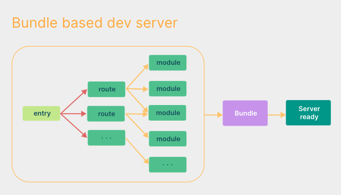
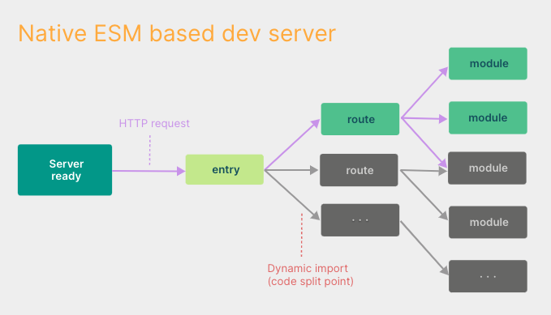
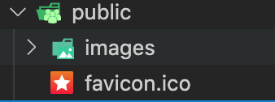
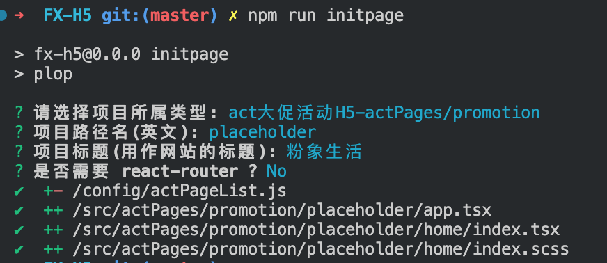
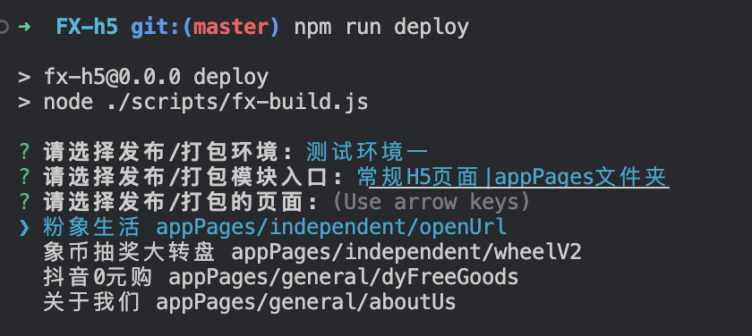

# Vite3 实现H5多入口打包工程

## 为什么选 `vite`

在浏览器支持 `ES` 模块之前，`JavaScript` 并没有提供原生机制让开发者以模块化的方式进行开发。这也正是我们对 “打包” 这个概念熟悉的原因：使用工具抓取、处理并将我们的源码模块串联成可以在浏览器中运行的文件。

时过境迁，我们见证了诸如 `webpack`、`Rollup` 和 `Parcel` 等工具的变迁，它们极大地改善了前端开发者的开发体验。

然而，当我们开始构建越来越大型的应用时，需要处理的 `JavaScript` 代码量也呈指数级增长。包含数千个模块的大型项目相当普遍。基于 `JavaScript` 开发的工具就会开始遇到性能瓶颈：通常需要很长时间（甚至是几分钟！）才能启动开发服务器，即使使用模块热替换（HMR），文件修改后的效果也需要几秒钟才能在浏览器中反映出来。如此循环往复，迟钝的反馈会极大地影响开发者的开发效率和幸福感。

`Vite` 旨在利用生态系统中的新进展解决上述问题：浏览器开始原生支持 `ES` 模块，且越来越多 `JavaScript` 工具使用编译型语言编写。

## 缓慢的服务器启动
当冷启动开发服务器时，基于打包器的方式启动必须优先抓取并构建你的整个应用，然后才能提供服务。

`Vite` 通过在一开始将应用中的模块区分为 依赖 和 源码 两类，改进了开发服务器启动时间。

● 依赖  大多为在开发时不会变动的纯 `JavaScript`。一些较大的依赖（例如有上百个模块的组件库）处理的代价也很高。依赖也通常会存在多种模块化格式（例如 `ESM` 或者 `CommonJS`）。`Vite` 将会使用 `esbuild` 预构建依赖。`esbuild` 使用 `Go` 编写，并且比以 `JavaScript` 编写的打包器预构建依赖快 `10-100` 倍。

● 源码  通常包含一些并非直接是 `JavaScript` 的文件，需要转换（例如 `JSX`，`CSS` 或者 `Vue/Svelte` 组件），时常会被编辑。同时，并不是所有的源码都需要同时被加载（例如基于路由拆分的代码模块）。`Vite` 以 原生 `ESM` 方式提供源码。这实际上是让浏览器接管了打包程序的部分工作：`Vite` 只需要在浏览器请求源码时进行转换并按需提供源码。根据情景动态导入代码，即只在当前屏幕上实际使用时才会被处理。





## 缓慢的更新

基于打包器启动时，重建整个包的效率很低。原因显而易见：因为这样更新速度会随着应用体积增长而直线下降。

一些打包器的开发服务器将构建内容存入内存，这样它们只需要在文件更改时使模块图的一部分失活[1]，但它也仍需要整个重新构建并重载页面。这样代价很高，并且重新加载页面会消除应用的当前状态，所以打包器支持了动态模块热替换（`HMR`）：允许一个模块 “热替换” 它自己，而不会影响页面其余部分。这大大改进了开发体验 —— 然而，在实践中我们发现，即使采用了 HMR 模式，其热更新速度也会随着应用规模的增长而显著下降。

在 `Vite` 中，`HMR` 是在原生 `ESM` 上执行的。当编辑一个文件时，`Vite` 只需要精确地使已编辑的模块与其最近的 `HMR` 边界之间的链失活[1]（大多数时候只是模块本身），使得无论应用大小如何，HMR 始终能保持快速更新。

`Vite` 同时利用 `HTTP` 头来加速整个页面的重新加载（再次让浏览器为我们做更多事情）：源码模块的请求会根据 `304 Not Modified` 进行协商缓存，而依赖模块请求则会通过 `Cache-Control: max-age=31536000`,`immutable` 进行强缓存，因此一旦被缓存它们将不需要再次请求。

一旦你体验到 `Vite` 的神速，你是否愿意再忍受像曾经那样使用打包器开发就要打上一个大大的问号了。

## 总览
`Vite`（法语意为 "快速的"，发音 `/vit/`，发音同 `"veet"`）是一种新型前端构建工具，能够显著提升前端开发体验。它主要由两部分组成：

-  一个开发服务器，它基于 原生 `ES` 模块 提供了 丰富的内建功能，如速度快到惊人的 模块热更新（`HMR`）。
- 一套构建指令，它使用 `Rollup` 打包你的代码，并且它是预配置的，可输出用于生产环境的高度优化过的静态资源。
  
`Vite` 意在提供开箱即用的配置，同时它的 插件 `API` 和 `JavaScript API` 带来了高度的可扩展性，并有完整的类型支持。

你可以在 [为什么选 Vite](https://vitejs.cn/vite3-cn/guide/why.html) 中了解更多关于项目的设计初衷。

## 浏览器支持
默认的构建目标是能支持 原生 `ESM` 语法的 `script` 标签、原生 `ESM` 动态导入 和 `import.meta` 的浏览器。传统浏览器可以通过官方插件 `@vitejs/plugin-legacy` 支持 —— 查看 构建生产版本 章节获取更多细节

## vite3 初始化项目框架

有关 `vite` 配置详情请移步[官方文档](https://vitejs.cn/vite3-cn/guide/)

::: tip 兼容性注意
Vite 需要 Node.js 版本 14.18+，16+。然而，有些模板需要依赖更高的 Node 版本才能正常运行，当你的包管理器发出警告时，请注意升级你的 Node 版本。
:::

使用 NPM:
```sh
$ npm create vite@latest  
```
使用 Yarn:
```sh
$ yarn create vite
```
使用pnpm
```sh
$ pnpm create vite
```
然后按照提示操作即可！

你还可以通过附加的命令行选项直接指定项目名称和你想要使用的模板。例如，要构建一个 `Vite + Vue` 项目，运行:
```sh
# npm 6.x 
npm create vite@latest my-vue-app --template vue  

# npm 7+, extra double-dash is needed: 
npm create vite@latest my-vue-app -- --template vue

# yarn
yarn create vite my-vue-app --template vue 

# pnpm
pnpm create vite my-vue-app --template vue 
```

查看 [create-vite](https://github.com/vitejs/vite/tree/main/packages/create-vite) 以获取每个模板的更多细节：`vanilla`，`vanilla-ts`，`vue`，`vue-ts`，`react`，`react-ts`，`preact`，`preact-ts`，`lit`，`lit-ts`，`svelte`，`svelte-ts`。

本次项目使用react-ts模版
```sh
npm create vite@latest FX—H5 -- --template react-ts
```

## 项目基础配置
`pubilc` 文件夹中的静态资源 打包后会放到项目跟目录下


其他vite项目配置
```ts
import { defineConfig } from 'vite';
import legacy from '@vitejs/plugin-legacy';
import react from '@vitejs/plugin-react';
import vitePluginImp from 'vite-plugin-imp';
import { resolve } from 'path';
import { fxBuild } from './scripts/rollup-plugin-fx-build';

// https://vitejs.dev/config/
export default defineConfig(({ command, mode, ssrBuild }) => {
  return {
    plugins: [
      legacy({
        targets: ['defaults', 'not IE 11'],
        // 开发环境和生产环境均通过 @vitejs/plugin-legacy 插件进行代码转译
      }),
      react(),
      vitePluginImp({}),
      fxBuild(),  // 粉象打包插件
    ],
    // 需要使用相对路径，因为项目部署在服务器子文件夹中 （eg：/assets/a.js => ***.com/assets/a.js 不存在）
    base: './',
    resolve: {
      alias: {
        '@': resolve(__dirname, 'src'),
      },
    },
    server: {
      host: '0.0.0.0',
      open: '/index.html?appToken=0af0c773c04ca654f19514fbb51f4352&did=B4B88CE9-F39A-48A6-9DA9-9E2BE8D3CD27&uid=108',
      proxy: {},
    },
    build: {
      rollupOptions: {
        input: {},
        output: {
          assetFileNames: 'assets/[hash]-[hash][extname]',
        },
      },
    },
  };
});
```
## CSS相关配置
延用老项目的 重置样式 和常用的公共样式，继续使用`vscode`插件进行 `px to rem` 转换

使用 `sass` 进行 `css` 预处理
```sh
$ npm add -D sass
```

任何以 `.module.css` 为后缀名的 `CSS` 文件都被认为是一个 `CSS modules` 文件。导入这样的文件会返回一个相应的模块对象：
```ts
.red { 
  color: red;
} 

import classes from './example.module.css' 
document.getElementById('foo').className = classes.red
```
## eslint & prettierrc 相关配置

`prettierrc`使用新制定的规范配置(`vsCode`插件进行代码格式化)，因为 `prettierrc` 需要使用 `CommonJS` 模块化格式配置（试过使用ESM模块化格式配置，但是不生效果，目前不知道怎么解决）所以用 `.cjs` 最为文件后缀

`eslint` 同样使用新制定的通用规范配置，也是使用 `CommonJS` 模块化格式配置

需要安装的依赖

- eslint
- eslint-plugin-react
- eslint-plugin-react-hooks
- eslint-config-alloy
- typescript 
- @typescript-eslint/parser
- @typescript-eslint/eslint-plugin 

项目依赖库
- fx-tools			--  粉象工具库
- antd-mobile 		-- v: 5
- react    			-- v: 18
- react-dom			-- v: 18
- react-router-dom	-- v: 6
- query-string		-- v: 7
  
项目继续使用 `query-string` 处理路由参数，`antd-mobile` 升级至 `v5`，`react` 升级至 `18`，`react-router-dom`升级至 `v6`，用 `fx-tools` 完全替代 `fx-shared` 工具库。

工程内页面可以使用 `React-router-dom` 开发多路由项目，也可以不使用 `React-router-dom` 直接开发简单的单页面项目。

- 使用`React-router-dom` 开发：

当需要用到`React-router-dom`的时候，使用 `lazy`，`Suspense` 进行路由懒加载，`route` 组件的 `errorElement` 属性进行错误边界处理
::: details with router 页面入口文件 app.tsx
```tsx
import React, { lazy, Suspense, useEffect } from 'react';
import ReactDOM from 'react-dom/client';
import { invokeInit } from 'fx-tools';
import { createHashRouter, RouterProvider } from 'react-router-dom';
import ErrorBoundary from '@/components/errorBoundary/index';
import { errorReporteInit } from '@/utils/errorReporter/index';
import '@/assets/style/common.scss';
import '@/assets/style/init.scss';

const Home = lazy(() => import('./home'));
const Rule = lazy(() => import('./rule'));

const router = createHashRouter([
  {
    path: '/',
    element: <Home />,
    errorElement: <ErrorBoundary />,
  },
  {
    path: '/rule',
    element: <Rule />,
    errorElement: <ErrorBoundary />,
  },
]);

const App = () => {
  useEffect(() => {
    errorReporteInit(); // 错误上报
    invokeInit(); // app通信方法
  }, []);

  return (
    <Suspense fallback={null}>
      <RouterProvider router={router} />
    </Suspense>
  );
};

if (import.meta.env.PROD) {
  ReactDOM.createRoot(document.getElementById('root') as HTMLElement).render(
    <React.StrictMode>
      <App />
    </React.StrictMode>,
  );
}

export default App;
```
:::

- 不使用 `React-router-dom` 开发：
  
当不需要用到 `React-router-dom` 的时候，只需使用高阶组件 `ErrorBoundaryWraper`，通过 `componentDidCatch` 钩子函数对页面进行错误边界处理
::: details without router 页面入口文件 app.tsx
```tsx
import React, { lazy, Suspense, useEffect } from 'react';
import ReactDOM from 'react-dom/client';
import { invokeInit } from 'fx-tools';
import { createHashRouter, RouterProvider } from 'react-router-dom';
import ErrorBoundary from '@/components/errorBoundary/index';
import { errorReporteInit } from '@/utils/errorReporter/index';
import '@/assets/style/common.scss';
import '@/assets/style/init.scss';

const Home = lazy(() => import('./home'));
const Rule = lazy(() => import('./rule'));

const router = createHashRouter([
  {
    path: '/',
    element: <Home />,
    errorElement: <ErrorBoundary />,
  },
  {
    path: '/rule',
    element: <Rule />,
    errorElement: <ErrorBoundary />,
  },
]);

const App = () => {
  useEffect(() => {
    errorReporteInit(); // 错误上报
    invokeInit(); // app通信方法
  }, []);

  return (
    <Suspense fallback={null}>
      <RouterProvider router={router} />
    </Suspense>
  );
};

if (import.meta.env.PROD) {
  ReactDOM.createRoot(document.getElementById('root') as HTMLElement).render(
    <React.StrictMode>
      <App />
    </React.StrictMode>,
  );
}

export default App;
```
:::

## 新页面开发初始化
目前项目页面类型分类：
|    页面类型    |  页面对应文件夹  | 
| ------------- | :-----------: | 
| app常规功能H5 | src/appPages/general      |
| app独立功能H5 | src/appPages/independent  | 
| act普通活动H5 | src/actPages/general      |
| act长期活动H5 | src/actPages/persistent   |
| act大促活动H5 | src/actPages/promotion    |

新页面创建流程：

- 在相应文件夹中新增页面文件夹
- 创建页面入口文件 `app.tsx`  -- 入口文件使用相关模版  `plop-templates`
- 在对应页面集合配置文件中加入新页面信息   -- `config/actPageList.js  config/actPageList.js`
  
或使用 `npm run initpage` 命令自动创建相关页面

注意⚠️： 项目路径名为  打包发布后的页面子路由

## 页面启动及打包部署
由于在现有的`vite`项目中，不能很好的支持我们多页面开发的需求，所以对项目本地服务的启动和页面打包部署做了一些修改，以满足我们的开发需求。

## 开发服务器
因为项目会存在很多独立的H5页面，开发过程中难免会出现切换开发页面的情况。老的框架需要重新启动本地服务来选择开发页面，比较繁琐耗时。而`vite3`搭建的项目中，支持动态导入模块，借助这一特性，开发服务器统一使用相同的启动入口，并通过配置开发配置项目来动态导入不同页面模块，以达到快速切换开发页面的功能。

首先启动命令没有修改
```sh
$ npm run dev
```
但是需要有快速选择不同页面开发的能力，所以使用了`vite`动态导入的功能，并通过修改开发配置文件来切换开发页面。

开发服务器所有页面统一使用相同的 `main.tsx` ，入口是 `index.html`
:::details main.txs
```tsx
import ReactDOM from 'react-dom/client';
import { PAGE_PATH, PAGE_TYPE } from '../config/dev.config';
import DevImportFailedApp from './components/devImportFailedApp/index';

const tsxImport = `./${PAGE_TYPE}/${PAGE_PATH}/app.tsx`;

import(/* @vite-ignore */ tsxImport).then(
  (res) => {
    const App = res.default;
    ReactDOM.createRoot(document.getElementById('root') as HTMLElement).render(<App />);
  },
  () => {
    ReactDOM.createRoot(document.getElementById('root') as HTMLElement).render(
      <DevImportFailedApp pagePath={PAGE_PATH} pageType={PAGE_TYPE} />,
    );
  },
);

```
:::

启动开发服务的时候，会根据 `dev.config.ts` 配置的 `PAGE_PATH` , `PAGE_TYPE` 去匹配加载对应的页面模块，然后进行开发渲染。切换开发页面只需修改配置即可，`vite`会监视文件变的，重新加载页面。
::: details dev.config.ts
```ts
export const PAGE_TYPE = 'appPages'; // 项目类型
export const PAGE_PATH = 'independent/wheelV2'; // 项目页面
export const APP_LOCAL_ENV = 'test3'; // 本地服务api 环境
```
:::

## 打包部署
工程需要能对页面进行分开独立打包，而 `vite` 的多页面打包能力不是很适合我们的需求，所以在其基础上做了一些修改。
```sh
# "deploy": "node ./scripts/fx-build.js"
$ npm run deploy
```

打包部署前首先会执行 `fx-build.js`，去选择打包发布的页面，脚本会把选择的入口参数保存到 `build.config.ts` 配置文件中，并且自动生成打包页面模块的入口文件 `index.html`，以便后面打包发布流程使用。

 

打包页面的`list`则读取，新建页面文件时编辑的页面集合`list`，`appPageList.js` ,`actPageList.js`

 
```ts
// build.config.ts
export default {
  buildApiEnv: 'prod',                     // 打包页面API接口环境
  buildPageType: 'appPages',							 // 打包页面类型
  buildPagePath: 'independent/openUrl',		 // 打包页面所在文件夹
  buildPageTitle: '粉象生活',							 // 打包页面标题
  buildRouterPath: 'openUrl',							 // 打包页面子路由
};
```
然后进行打包，在打包的时候入口文件和打包入口配置项要动态写入。这样来达到单个页面文件的独立打包。为了实现上述操作，所以编写了一个 `rollup.js` 的定制化打包插件 `rollup-plugin-fx-build.js`


::: details rollup-plugin-fx-build.js
```js
import fs from 'fs';
    bucketPath += `/${buildRouterPath}`;
    url = `https://pre.xxxxx.com/${bucketPath}/index.html`;
  } else if (buildApiEnv === 'prod') {
    bucketName = 'feixiangm';
    bucketPath += `/${buildRouterPath}`;
    url = `https://m.xxxxxx.com/${bucketPath}/index.html`;
  } else {
    envNum = buildApiEnv.split('test')[1];
    bucketPath += `${envNum > 1 ? envNum : ''}/${buildRouterPath}`;
    url = `https://test.xxxxx.com/${bucketPath}/index.html`;
  }

  const uploadPromise = fxSharedNode.uploadOSS('dist', bucketPath, bucketName);
  return { uploadPromise, url };
}

// rollup-plugin-fx-build.js
export const fxBuild = async () => {
  const appBasePath = process.cwd();
  const buildConfig = await import('../config/build.config.ts').then((r) => r.default || {});
  const { buildApiEnv, buildPageType, buildPagePath, buildPageTitle, buildRouterPath } = buildConfig;
  const inputFile = `${appBasePath}/src/${buildPageType}/${buildPagePath}/index.html`;

  return {
    name: 'rollup-plugin-fx-build', // this name will show up in warnings and errors
    apply: 'build', // 或 'serve'
    options(options) {
      options.input[buildRouterPath] = inputFile;
      return options;
    },
    // buildStart() {},
    writeBundle(options, bundle) {
      // 迁移index.html入口文件位置 `src/${PAGE_TYPE}/${PAGE_PATH}/index.html` => /index.html
      const htmlPath = `src/${buildPageType}/${buildPagePath}/index.html`;
      if (bundle[htmlPath]) {
        let outputHtml = bundle[htmlPath].source;
        // outputHtml = outputHtml.toString().replace(/\=\"\/assets\//g, '="./assets/');
        outputHtml = outputHtml.toString().replace(/\.\.\/assets\//g, './assets/');
        outputHtml = outputHtml.toString().replace(/\.\.\//g, '');
        fs.writeFile(`${appBasePath}/dist/index.html`, outputHtml, (err) => {
          if (!err) {
            emptyDir(`${appBasePath}/dist/src`);
            // fs.unlinkSync(`${appBasePath}/config/build.config.ts`);
            fs.unlinkSync(`${appBasePath}/${htmlPath}`);
            // console.log(green(`${buildPageTitle} ${buildPageType}/${buildPagePath}/index.html 页面打包完成 开始上传`));
            const { uploadPromise, url } = uploadFiles(buildApiEnv, buildPageType, buildRouterPath);
            uploadPromise.then(() => {
              console.log(green(`${buildPageTitle} 页面上传成功`));
              console.log(link(`页面链接：${url}`));
            });
          } else {
            console.log(red(`入口文件处理错误：${err}`));
          }
        });
      }
    },
  };
};
```
:::

改插件在页面模块打包成功后会对 `index.html` 文件进行移动修改，最后进行上传 `oss` 操作，删除无用文件，整个打包部署流程结束。
有关rollup.js 详细介绍，请移步[官方文档](https://www.rollupjs.com/)

