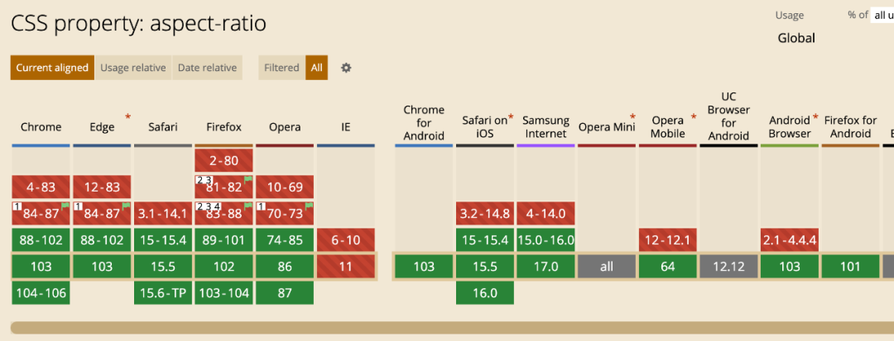

# CSS 常用语法记录

## aspect-ratio 为元素设置宽高比
```css
.img_container {
  width: 100%;
  aspect-ratio: 16 / 9;
}
```



## 刘海屏顶部定位兼容

1. 在index.html文件的meta标签content属性中添加viewport-fit=cover值开启ios的安全区域模式。
2. 给需要定位的模块设置默认的top值，安卓设备会使用这个默认值
3. 有些全屏面的安卓手机(例如小米10)会将专门给ios刘海屏的top: env(safe-area-inset-top)属性识别0，所以判断系统是否为ios，给ios系统添加一个特定的类topfix，让元素在ios下使用特殊的高度。
4. 通过CSS的@supports函数判断，仅在支持top: env(safe-area-inset-top)属性的ios设备下使用top: env(safe-area-inset-top)值。

::: details 点击查看详情
index.html中的meta标签添加viewport-fit=cover,开启ios安全区域模式
```html

<meta name="viewport" content="viewport-fit=cover, width=device-width, initial-scale=1.0, maximum-scale=1.0, minimum-scale=1.0, user-scalable=no" />
```
给ios添加默认的topfix类
```js
if (isIos) {
  document.querySelector('.home').classList.add('topfix');
}
```
css样式
```css
/* 安卓使用默认的高度 */
.home {
  .topContent {
    top: 2rem;
  }
}

/* 不支持top: env(safe-area-inset-top)的ios设备使用的自定义的top值 */
.home {
  &.topfix {
    .topContent {
      top: 2rem;
    }
  }
}

/* 支持top: env(safe-area-inset-top)的ios设备使用top: env(safe-area-inset-top)值 */
@supports (top: env(safe-area-inset-top)) {
  .home {
    &.topfix {
      .topContent {
        top: env(safe-area-inset-top);
        /* env(safe-area-inset-top)支持计算属性 */
        top: calc(env(safe-area-inset-top) + 2rem);
        
      }
    }
  }
}
```
:::

## 滚动条样式

```css
/* 滚动条 */
::-webkit-scrollbar {
  /* 纵向 */
  width: 8px;
  /* 横向 */
  height: 8px;
  background-color: #ededed;
}
/* 滚动条上的按钮(上下箭头) */
::-webkit-scrollbar-button {
  display: none;
}
/* 滚动条轨道 */
::-webkit-scrollbar-track {
  background-color: #ededed;
}
/* 滚动条轨道，没有滑块 */
::-webkit-scrollbar-track-piece {
  background-color: #ededed;
}
/* 垂直滚动条和水平滚动条交汇的部分 */
::-webkit-scrollbar-corner {
  background-color: #ededed;
}
/* 滚动条上的滚动滑块 */
::-webkit-scrollbar-thumb {
  border-radius: 10px;
  background-color: #d6d6d6;
}
/* 右下角拖动块 */
::-webkit-resizer {
  display: none;
}
```

[MDN](https://developer.mozilla.org/zh-CN/docs/Web/CSS/::-webkit-scrollbar)
