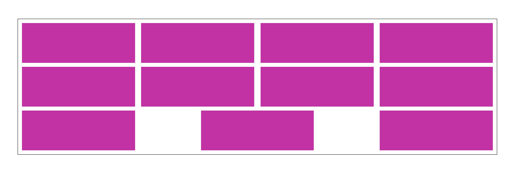
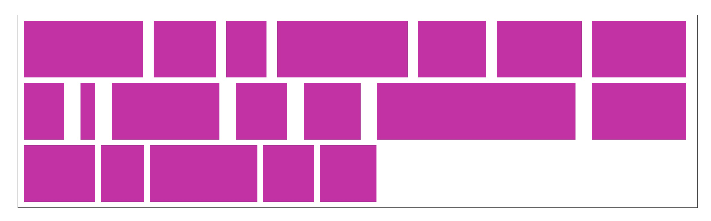
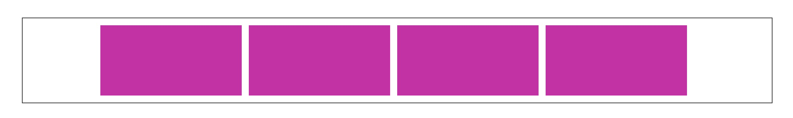
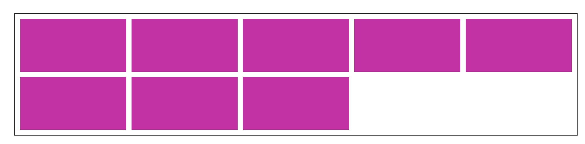

# CSS 奇淫技巧

## 伪元素content实现打点loading动画

通过动态设置伪元素content属性的内容，加上CSS3的step帧动画，可以实现一个打点的动画

::: details 点击查看css样式
```css
<div class="div7">
  <div class="div7-item">提交订单中<span></span></div>
</div>

.div7 {
    text-align: center;
    margin: 200px auto;
    .div7-item {
      text-align: left;
      background: #289600;
      color: white;
      display: inline-block;
      font-size: 40px;
      line-height: 80px;
      height: 80px;
      // overflow: hidden;
      padding: 0 20px;
      span {
        position: relative;
        padding-right: 40px;
        &:before {
          position: absolute;
          display: inline-block;
          content: "...";
          animation: dot 3s infinite step-start reverse both;
        }
      }

      @keyframes dot {
        33% {
          content: '..';
        }
        66% {
          content: '.';
        }
      }
    }
  }
```
:::
点击查看案例：[案例地址](https://codesandbox.io/s/interesting-wing-evsw2)

## flex布局space-between最后一行左对齐

space-between布局情况下，当最后一行元素不能填满时，会出现这样的情况:



使用CSS计算属性计算出最后一个元素的右边距，让元素形成靠左对齐的样式
::: details css 样式实现
```css
.div {
    display: flex;
    justify-content: space-between;
    flex-wrap: wrap;
    border: 1px solid #333;
    width: 1200px;
    margin: 100px auto;
    padding: 10px 10px 0;
    li {
      width: 24%;
      height: 100px;
      background: #c80caa;
      margin-bottom: 10px;
      /* 最后一行3个元素情况 */
      &:last-child:nth-child(4n - 1) {
        margin-right: calc(24% + 4% / 3);
      }
      // /* 最后一行2个元素情况 */
      &:last-child:nth-child(4n - 2) {
        margin-right: calc(48% + 8% / 3);
      }
    }
  }
```
:::

当元素宽度不固定时，只要给最后一个元素加一行代码就可以实现

```css
:last-child {
  margin-right: auto;
}
```


## 根据子元素数量不同显示不同的样式

如果一个元素，既是第一个，又是倒数第n个，就表示这个父元素中总共有n个子元素。组合兄弟选择器 ~ 使用，就可以选中有n个子元素情况下的所有元素，通过这种方法就可以根据子元素的数量来显示不同的样式

```css
li {
  width: 200px;
  height: 100px;
  display: inline-block;
  vertical-align: top;
  margin: 0 10px 10px 0;
  background: #c80caa;
  &:nth-child(5n) {
    margin-right: 0;
  }
  &:first-child:nth-last-child(n + 6),
  &:first-child:nth-last-child(n + 6) ~ li {
    float: left;
  }
}
```
少于5个元素的情况下会居中对齐


当超过5个元素时会靠左对齐



## 一层dom结构实现内容定宽居中
```css{3}
.dom {
  // 使用CSS3的计算数学calc，将内边距设置为(50% - 550px)，内容的宽度就变成了550px × 2。
  padding: 200px calc(50% - 550px);
  background: #999;
}
```

## 透明边框扩大可点击区域
```css{4}
.btn {
  // ...
  // 边框也会触发点击事件，给透明的边框可以让可点击区域比看上去更大
  border: 10px solid transparent; 
}
```

## 内容最小为屏幕高度&页脚紧贴底部
::: details flex 实现样式
```css
<div class="div3">
  <div class="content">
    <p>内容内容内容</p>
    <p>内容内容内容</p>
    <p>内容内容内容</p>
  </div>
  <footer class="footer">页脚页脚页脚</footer>
</div>

.div3 {
  text-align: center;
  display: flex;
  flex-direction: column;
  min-height: 100vh;
  .content {
    flex: 1;
  }
  .footer {
    color: white;
    background: #333;
    padding: 20px 0;
  }
}
```
:::

## 识别 HTML 字符中的 \n

::: tip
`white-space` 属性用于设置如何处理元素中的空白
:::

```css
white-space: pre;
```

|    属性值    | 换行符 | 空格和制表符 | 文字换行 |
| :----------: | :----: | :----------: | :------: |
|    normal    |  合并  |     合并     |   换行   |
|    nowrap    |  合并  |     合并     |  不换行  |
|     pre      |  保留  |     保留     |  不换行  |
|   pre-wrap   |  保留  |     保留     |   换行   |
|   pre-line   |  保留  |     合并     |   换行   |
| break-spaces |  保留  |     保留     |   换行   |

[MDN](https://developer.mozilla.org/zh-CN/docs/Web/CSS/white-space)

## CSS(Unicode 字符) 实现换行

::: tip
在 `Unicode` 中，`0x000A` 字符是专门控制换行的。在 `CSS` 中，我们可以写为 `\A` 或 `\000A` 作为 `after` 伪元素的内容，并添加到指定元素中实现换行效果。
:::

```html
<div>
  <span class="br">前端常用知识软件推荐</span>
  <span class="br">踩坑记录</span>
  <span>各种兼容问题</span>
</div>
```

```css
.br::after {
  content: '\A';
  white-space: pre;
}
```

<style>
.br::after {
  content: '\A';
  white-space: pre;
}
</style>
<div>
  <span class="br">前端常用知识软件推荐</span>
  <span class="br">踩坑记录</span>
  <span>各种兼容问题</span>
</div>

[使用 CSS(Unicode 字符)让 inline 水平元素换行](https://www.zhangxinxu.com/wordpress/2012/03/tip-css-multiline-display/)

## 网页置灰

```css
html {
  filter: grayscale(100%);
  -webkit-filter: grayscale(100%);
  -moz-filter: grayscale(100%);
  -ms-filter: grayscale(100%);
  -o-filter: grayscale(100%);
  /* 兼容 Firefox */
  filter: url("data:image/svg+xml;utf8,<svg xmlns='http://www.w3.org/2000/svg'><filter id='grayscale'><feColorMatrix type='matrix' values='0.3333 0.3333 0.3333 0 0 0.3333 0.3333 0.3333 0 0 0.3333 0.3333 0.3333 0 0 0 0 0 1 0'/></filter></svg>#grayscale");
  /* 兼容 IE */
  filter: progid:DXImageTransform.Microsoft.BasicImage(grayscale=1);
  /*兼容 Chrome Safari Edge 等 */
  -webkit-filter: grayscale(1);
}
```

[一段 css 让全站变灰](https://juejin.cn/post/6844904114053185544)
[filter - CSS —— MDN](https://developer.mozilla.org/zh-CN/docs/Web/CSS/filter)
