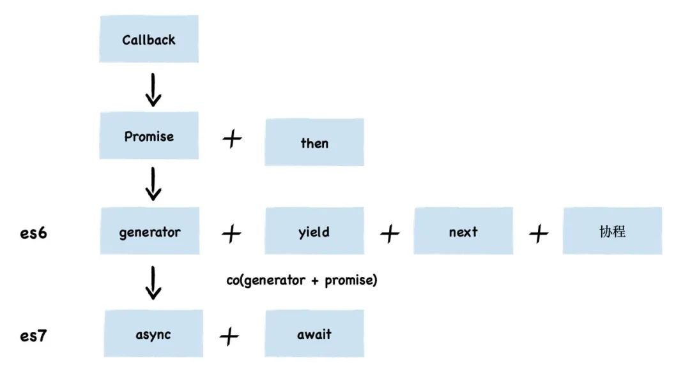

# JS异步解决方案

在刚JS设计之初异步的解决方案是通过callback的方式去解决问题，但随着业务代码的复杂程度加剧，往往会出现大量的 callback ，这样就会使代码可读性大大下降，编码的时候也特别不方便。
为了解决这种回调地狱的问题，`JS` 先后推出 `Promise` `generator` 和 `async/await` 几种异步编程方案。

JS 异步编程进化史



最开始出现的异步编程解决方案就是我们大家熟知的 `Promise`, 但是 `Promise` api的出现并没有解决回调地狱的问题，比如下面的例子：

```js
function request(num) { // 模拟接口请求
  return new Promise(resolve => {
    setTimeout(() => {
      resolve(num * 2)
    }, 1000)
  })
}

request(1).then(res1 => {
  console.log(res1) // 1秒后 输出 2

  request(2).then(res2 => {
    console.log(res2) // 2秒后 输出 4
  })
})
```

像这样嵌套层级一多，仍然是一推括号相互叠加，头皮发麻。所以为了解决问题，`generator` 就被推了出来。

## `Generator` 函数

`generator` 函数跟普通函数在写法上的区别就是，多了一个星号 * 。

函数内部可以通过 `yield` 进行暂停。

函数直接调用即可，但是函数不会执行，此时只是得到了一个 `Generator` 对象，需要调用 `Generator` 对象的 `next` 方法逐步执行。

`next` 方法执行后会返回一个对象，对象中有 `value` 和 `done` 两个属性
 - `value`：暂停点后面接的值，也就是 `yield` 后面接的值；
 - `done`：是否 `generator` 函数已走完，没走完为 `false`，走完为 `true`；

在 `generator` 具体运用中，每次遇到yield关键字都会暂停执行，当调用迭代器的next时，会将 `yield` 后面表达式的值作为返回对象的 `value`。

```js
function* gen() {
  yield 1
  yield 2
  yield 3
}
const g = gen()

console.log(g.next()) // { value: 1, done: false }
console.log(g.next()) // { value: 2, done: false }
console.log(g.next()) // { value: 3, done: false }
console.log(g.next()) // { value: undefined, done: true }
```

## next
`generator` 函数可以用 `next` 方法来传参，并且可以通过 `yield` 来接收这个参数，但是得注意：

- 第一次 next 传递参数无效，第一次的 next 的参数由函数调用传递
- 下一次调用next的时候，传的参数会被作为上一个yield前面接受的值
- next传值时，要记住顺序是，先右边yield，后左边接收参数；

```js
function* fn(num) {
  console.log(num)
  console.log('第一次next')
  // 需要注意的是，第一次调next时，整个迭代器目前暂停在了第一个yield这里，
  // 给变量num1赋值都没执行，要调用下一个next的时候才会给变量num1赋值，然后一直执行到第二个yield
  const num1 = yield 1
  console.log(num1)
  console.log('第二次next')
  const num2 = yield 2
  console.log(num2)
}

const gen = fn(0)

gen.next(0000)  // 第一次传递的参数无效
// 0    
// 第一次next
gen.next(1111) 
// 1111  
// 第二次next
gen.next(2222)
//  2222
```

## throw

迭代器还有个方法是 `throw`，这个方法可以在函数体外部抛出错误，然后在函数里面捕获
```js
function* gen() {
  try {
    yield 1
    yield 2
    yield 3
  } catch(e){
    console.log(e)
    yield 4
  }
  
}
const g = gen();

g.next();
g.throw('err');
// err   {value: 4, done: false}
g.next();
// {value: undefined, done: true}
```
上面代码中，错误在函数里面捕获了，走到了 `catch` 里面，这里面有一个 `console` 同步代码，所以会打印捕获的错误，并执行下面个 `yield`，在下面我们还可以继续执行 `next`。

## `return`

迭代器还有个 `return` 方法，他会直接终止当前迭代器，将 `done` 置为 `true`，这个方法的参数就是迭代器的 `value`
```js
function* gen() {
  try {
    yield 1
    yield 2
    yield 3
  } catch(e){
    console.log(e)
    yield 4
  }
  
}
const g = gen();

g.return('123');
// {value: '123', done: true}
```

## `yield*`

简单理解，`yield*` 就是在生成器里面调用另一个生成器，但是他并不会占用一个 `next`，而是直接进入被调用的生成器去运行。
```js
function* gen() {
  let a = yield 1;
  let b = yield a + 2;
}

function* gen2() {
  yield 10 + 5;
  yield* gen();
}
const g = gen2();

g.next();
// {value: 15, done: false}
g.next();
// {value: 1, done: false}
g.next(2);
// {value: 4, done: false}
```
上面代码我们第一次调用 `next`，值自然是10 + 5，即15，然后第二次调用 `next`，其实就走到了 `yield*` 了，这其实就相当于调用了 `gen`，然后执行他的第一个 `yield`，值就是1,然后再次调用 `next`，就相当于调用了 `gen` 的第二个 `yield`。

::: tip
其实 `Generator` 就是实现了协程，协程是一种比线程更加轻量级的存在，协程完全由程序所控制，带来的好处是性能大幅度的提升。一个进程可以有多个线程，一个线程可以有多个协程，但是一个线程同时只能有一个协程在运行。这个意思就是说如果当前协程可以执行，比如同步代码，那就执行他，如果当前协程暂时不能继续执行，比如他是一个异步读文件的操作，那就将它挂起，然后去执行其他协程，等这个协程结果回来了，可以继续了再来执行他。`yield`其实就相当于将当前任务挂起了，下次调用再从这里开始。协程这个概念其实很多年前就已经被提出来了，其他很多语言也有自己的实现。`Generator` 相当于 `JS` 实现的协程。
:::

## `Promise` 结合 `generator` 函数使用

- 我们知道yield后面可以接Promise；
- 可以通过next进行参数传递

所以一起使用时的效果为：
```js
function fn(num) {
  return new Promise( resolve => {
    setTimeout(() => {
      resolve(num * 2)
    },1000)
  })
}

function *generator() {
  const num1 = yield fn(1)
  const num2 = yield fn(num1)
  const num3 = yield fn(num2)
  return num3
}

const gen = generator()   //生成一个迭代器

gen.next().value.then(res1 => {
  console.log(res1);  // 2
  gen.next(res1).value.then(res2 => {
    console.log(res2);  // 4
    gen.next(res2).value.then(res3 => {
      console.log(res3);  // 8
      console.log(gen.next(res3));  // { value: 8, done: true }
    })
  })
})
```

## 实现 `async/await`

上方 `Promise` 结合 `generator` 函数使用，就很像 `async/await` 了，区别在于

- `generator` 函数执行返回值不是 `Promise`，`async` 函数执行返回值是 `Promise`；
- `generator` 函数不能自动执行，只能手动触发
- `generator` 函数执行的操作是不完善的，因为并不确定有几个 `yield`，不确定会嵌套几次

```js
async function f(){
return 'hello world';
}
console.log(f())
// Promise {<fulfilled>: 'hello world'}
//     [[Prototype]]: Promise
//     [[PromiseState]]: "fulfilled"
//     [[PromiseResult]]: "hello world"
```

针对上面的情况，我们可以通过高阶函数进行封装 （ 高阶函数 ：参数是函数，返回值也可以是函数 ）

```js
function *gen(){}
function generatorToAsync(generatorFn){
  return function() {
    return new Promise((resolve,reject) => {

    })
  }
}
const asyncFn = generatorToAsync(gen)
```
把之前的代码代入到 `generatorToAsync `函数中
```js
// Promise结合generator函数使用
function fn(num) {
  return new Promise( resolve => {
    setTimeout(() => {
      resolve(num * 2)
    },1000)
  })
}

function* generator() {
  const num1 = yield fn(1)
  const num2 = yield fn(num1)
  const num3 = yield fn(num2)
  return num3
}

function generatorToAsync(generatorFn){
  return function() {
    return new Promise((resolve, reject) => {
      const gen = generatorFn()   //生成一个迭代器

      gen.next().value.then(res1 => {
        gen.next(res1).value.then(res2 => {
          gen.next(res2).value.then(res3 => {
            // console.log(gen.next(res3).value);  // { value: 8, done: true }
            resolve(gen.next(res3).value)
            
          })
        })
      })
    })
  }
}
const asyncFn = generatorToAsync(generator)
asyncFn().then(res => console.log(res))
```
到这里，就已经实现了 `async/await` 的初始功能了

因为 `async` 中可以支持若干个 `await`，`await` 的个数是不确定的。同样，`generator` 函数中，也可能有多个 `yield`，所以我们需要对上述代码进行改造
```js
// Promise结合generator函数使用
function fn(num) {
  return new Promise( resolve => {
    setTimeout(() => {
      resolve(num * 2)
    },1000)
  })
}

function* generator() {
  const num1 = yield fn(1)
  console.log(num1);
  const num2 = yield fn(num1)
  console.log(num2);
  const num3 = yield fn(num2)
  console.log(num3);
  return num3
}

function generatorToAsync(generatorFn){
  return function() {
    const gen = generatorFn.apply(this,arguments);   //生成一个迭代器  gen有可能传参
    return new Promise((resolve, reject) => {
      function go(key,arg){
        let res;
        try {
          res = gen[key](arg)
        } catch (error) {
          reject(error)
        }
        const {value,done} = res;
        if(done){
          resolve(value)
        }else {
          // -- 这行代码就是精髓 --
          // 将所有值promise化
          // 比如 yield 1
          // const a = Promise.resolve(1) a 是一个 promise
          // const b = Promise.resolve(a) b 是一个 promise
          // 可以做到统一 promise 输出
          Promise.resolve(value).then(res => go('next',res),err => go('throw',err))
        }
      }
      go('next')
    })
  }
}

const asyncFn = generatorToAsync(generator)
const asyncRes = asyncFn()
console.log(asyncRes);
asyncRes.then(res => console.log(res));

// Promise  2  4  8  8
```

然后再看看用 `async` 实现的效果
```js
async function asyncFn() {
  const num1 = await fn(1)
  console.log(num1)
  const num2 = await fn(num1)
  console.log(num2)
  const num3 = await fn(num2)
  console.log(num3)
  return num3
}
const asyncRes = asyncFn()
console.log(asyncRes) 
asyncRes.then(res => console.log(res)) 

// Promise  2  4  8  8
```
可以看出，我们的代码与 `async/await` 的输出完全一致。

## CO

[co库](https://github.com/tj/co)，用于 Generator 函数的自动执行

使用：
```js
co(function* () {
  var result = yield Promise.resolve(true);
  return result;
}).then(function (value) {
  console.log(value);
}, function (err) {
  console.error(err.stack);
});
```

源码片段：
```js
function co(gen) {
  var ctx = this;
  // 获取参数
  var args = slice.call(arguments, 1);
  // 返回一个 Promise
  return new Promise(function(resolve, reject) {
    // 把 ctx 和参数传递给 gen 函数
    if (typeof gen === 'function') gen = gen.apply(ctx, args);
    // 判断 gen.next 是否函数，如果不是直接 resolve(gen)
    if (!gen || typeof gen.next !== 'function') return resolve(gen);
    // 先执行一次 next
    onFulfilled();
    // 实际上就是执行 gen.next 函数，获取 gen 的值
    function onFulfilled(res) {
      var ret;
      try {
        ret = gen.next(res);
      } catch (e) {
        return reject(e);
      }
      next(ret);
      return null;
    }
    // 对 gen.throw 的处理
    function onRejected(err) {
      var ret;
      try {
        ret = gen.throw(err);
      } catch (e) {
        return reject(e);
      }
      next(ret);
    }
    // 实际处理的函数，会递归执行，直到 ret.done 状态为 true
    function next(ret) {
      // 如果生成器的状态 done 为 true，就 resolve(ret.value)，返回结果
      if (ret.done) return resolve(ret.value);
      // 否则，调用 toPromise.call(ctx, ret.value) 函数，toPromise 函数的作用是把 ret.value 转化成 Promise 类型，也就是用 Promise 包裹一层再 return 出去。
      var value = toPromise.call(ctx, ret.value);
      // 判断 value 是否 Promise，如果是就返回 then, 调用 onFulfilled 或 onRejected，实际上是递归调用了 next 函数本身，直到 done 状态为 true 或 throw error。
      if (value && isPromise(value)) return value.then(onFulfilled, onRejected);
      // 如果不是 Promise，Rejected
      return onRejected(new TypeError('You may only yield a function, promise, generator, array, or object, '
        + 'but the following object was passed: "' + String(ret.value) + '"'));
    }
  });
}

function toPromise(obj) {
  // 如果 obj 不存在，直接返回 obj
  if (!obj) return obj;
  // 如果 obj 是 Promise 类型，直接返回 obj
  if (isPromise(obj)) return obj;
  // 如果 obj 是生成器函数或遍历器对象, 就递归调用 co 函数
  if (isGeneratorFunction(obj) || isGenerator(obj)) return co.call(this, obj);
  // 如果 obj 是普通的函数类型，转换成 Promise 类型函数再返回
  if ('function' == typeof obj) return thunkToPromise.call(this, obj);
  // 如果 obj 是一个数组, 转换成 Promise 数组再返回
  if (Array.isArray(obj)) return arrayToPromise.call(this, obj);
  // 如果 obj 是一个对象, 转换成 Promise 对象再返回
  if (isObject(obj)) return objectToPromise.call(this, obj);
  // 其他情况直接返回
  return obj;
}
```