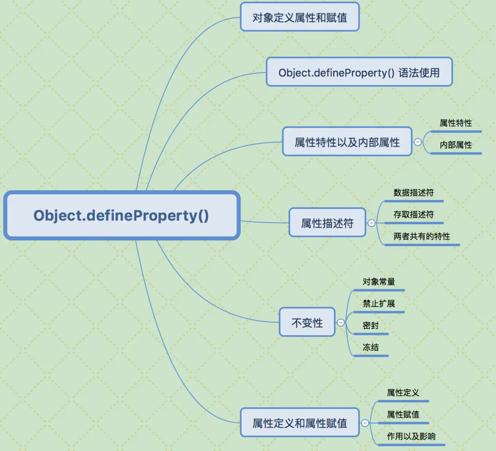

# 什么是装饰器

## 装饰器设计模式
装饰器模式（`Decorator Pattern`）允许向一个现有的对象添加新的功能，同时又不改变其结构。这种类型的设计模式属于结构型模式，它是作为现有的类的一个包装。这种模式创建了一个装饰类，用来包装原有的类，并在保持类方法签名完整性的前提下，提供了额外的功能。

## JS中的装饰器
装饰器（`Decorator`）是 `ES7` 中的一个新语法。它可以对类、方法、属性进行修饰，从而进行一些相关功能定制。它的写法与Java的注解（`Annotation`）非常相似，但是功能还是有很大区别。`JS` 中的 `Decorator` 在原理和功能上简单明了，简而言之就是对对象进行包装，返回一个新的对象描述（`descriptor`）。这个概念其实和 `React` 中的高阶组件也类似，大家可以用高阶组件的方式来理解它。

举个非常简单的例子，假设我们现在要对一个函数log，打印出它的执行记录。
- 不使用`Decorator`：
``` js
const log = (srcFun) => {
  if(typeof(srcFun) !== 'function') {
    throw new Error(`the param must be a function`);
  }
  return (...arguments) => {
    console.info(`${srcFun.name} invoke with ${arguments.join(',')}`);
    srcFun(...arguments);
  }
}
const plus = (a, b) => a + b;
const logPlus = log(plus);
logPlus(1,2); // this will log : plus invoke with 1,2
```
- 使用`Decorator`：
``` js
const log = (target, name, descriptor) => {
  var oldValue = descriptor.value;
  descriptor.value = function() {
    console.log(`Calling ${name} with`, arguments);
    return oldValue.apply(this, arguments);
  };
  return descriptor;
}
class Math {
  @log  // Decorator
  plus(a, b) {
    return a + b;
  }
}
const math = new Math();
math.add(1, 2); // this will log: Calling plus with 1,2
```
从上面的代码可以看出，如果有的时候我们并不需要关心函数的内部实现，仅仅是想调用它的话，装饰器能够带来比较好的可读性，使用起来也是非常的方便。

## `JS`装饰器原理`Object.defineProperty`
JS中的装饰器本质也是一个函数，利用的是 `JS` 中 `object` 的 `descriptor`，这个函数会接收三个参数:
```js
/**
 * 装饰器函数
 * @param {Object} target 被装饰器的类的原型
 * @param {string} name 被装饰的类、属性、方法的名字
 * @param {Object} descriptor 被装饰的类、属性、方法的descriptor
 */
function Decorator(target, name, descriptor) {
  // 以此可以获取实例化的时候此 属性 的默认值
  // 这是 Babel 的 Class 为了与 decorator 配合而产生的一个属性
  let v = descriptor.initializer && descriptor.initializer.call(this);
  // 返回一个新的描述对象作为被修饰对象的descriptor，或者直接修改 descriptor 也可以
  return {
    enumerable: true,
    configurable: true,
    get() {
      return v;
    },
    set(c) {
      v = c;
    },
  };
}
 // USE
 class Fudao{
    @Decorator
    title = "测试Decorator"
 }
 
```
装饰器也可以接受参数:
```js
// decorator 外部可以包装一个函数，函数可以带参数
function Decorator(type) {
  /**
* 装饰器函数
* @param {Object} target 被装饰器的类的原型
* @param {string} name 被装饰的类、属性、方法的名字
* @param {Object} descriptor 被装饰的类、属性、方法的descriptor
*/
  return (target, name, descriptor) => {
    // 以此可以获取实例化的时候此属性的默认值
    let v = descriptor.initializer && descriptor.initializer.call(this);
    // 返回一个新的描述对象作为被修饰对象的descriptor，或者直接修改 descriptor 也可以
    return {
      enumerable: true,
      configurable: true,
      get() {
        return v + type;
      },
      set(c) {
        v = c;
      },
    };
  }
}
// USE
 class Fudao{
    @Decorator('string') 
    title = "带参数Decorator“
 }
```


`Object.defineProperty(obj, prop, desc)` 的作用就是直接在一个对象上定义一个新属性，或者修改一个已经存在的属性
- `obj` 需要定义属性的当前对象
- `prop` 当前需要定义的属性名
- `desc` 属性描述符
  
一般通过为对象的属性赋值的情况下，对象的属性可以修改也可以删除，但是通过 `Object.defineProperty()` 定义属性，通过描述符的设置可以进行更精准的控制对象属性。

### 属性的特性以及内部属性
javacript 有三种类型的属性
- 命名数据属性：拥有一个确定的值的属性。这也是最常见的属性
- 命名访问器属性：通过 `getter` 和 `setter` 进行读取和赋值的属性
- 内部属性：由 `JavaScript` 引擎内部使用的属性，不能通过 `JavaScript` 代码直接访问到，不过可以通过一些方法间接的读取和设置。比如，每个对象都有一个内部属性 `[[Prototype]]`，你不能直接访问这个属性，但可以通过 `Object.getPrototypeOf()` 方法间接的读取到它的值。虽然内部属性通常用一个双吕括号包围的名称来表示，但实际上这并不是它们的名字，它们是一种抽象操作，是不可见的，根本没有上面两种属性有的那种字符串类型的属性。
  
### 属性描述符
通过 `Object.defineProperty()` 为对象定义属性，有两种形式，且不能混合使用，分别为数据描述符，存取描述符，下面分别描述下两者的区别：
- 数据描述符 --特有的两个属性 `（value,writable）`
```js
let Person = {}
Object.defineProperty(Person, 'name', {
   value: 'jack',
   writable: true // 是否可以改变
})
```
- 存取描述符 --是由一对 `getter、setter` 函数功能来描述的属性
`get`：一个给属性提供 `getter` 的方法，如果没有 `getter` 则为 `undefined`。该方法返回值被用作属性值。默认为`undefined`。
`set`：一个给属性提供 `setter` 的方法，如果没有 `setter` 则为 `undefined`。该方法将接受唯一参数，并将该参数的新值分配给该属性。默认值为 `undefined`。

### 数据描述符和存取描述均具有以下描述符
- `configrable` 描述属性是否配置，以及可否删除
- `enumerable` 描述属性是否会出现在 `for in` 或者 `Object.keys()` 的遍历中
  
::: tip
- `configurable: false` 时，不能删除当前属性，且不能重新配置当前属性的描述符(有一个小小的意外：可以把 `writable` 的状态由 `true` 改为 `false`,但是无法由 `false` 改为 `true`),但是在 `writable: true` 的情况下，可以改变 `value` 的值
- `configurable: true` 时，可以删除当前属性，可以配置当前属性所有描述符。
:::


### 不变性
- 对象常量
  
结合 `writable: false` 和 `configurable: false` 就可以创建一个真正的常量属性（不可修改，不可重新定义或者删除）

- 禁止扩展
  
如果你想禁止一个对象添加新属性并且保留已有属性，就可以使用 `Object.preventExtensions(...)` 在非严格模式下，创建属性 `gender` 会静默失败，在严格模式下，将会抛出异常。

- 密封
  
`Object.seal()` 会创建一个密封的对象，这个方法实际上会在一个现有对象上调用 `object.preventExtensions(...)` 并把所有现有属性标记为 `configurable:false`。所以， 密封之后不仅不能添加新属性，也不能重新配置或者删除任何现有属性（虽然可以改属性的值）

- 冻结
  
`Object.freeze()` 会创建一个冻结对象，这个方法实际上会在一个现有对象上调用 `Object.seal()` ,并把所有现有属性标记为 `writable: false`,这样就无法修改它们的值。

## 类的装饰
装饰器可以用来装饰整个类。
```js
@testable
class MyTestableClass {
  // ...
}
function testable(target) {
  target.isTestable = true;
}
MyTestableClass.isTestable // true
```
上面代码中，`@testable` 就是一个装饰器。它修改了 `MyTestableClass` 这个类的行为，为它加上了静态属性 `isTestable`。 `testable` 函数的参数 `target` 是 `MyTestableClass` 类本身。
基本上，装饰器的行为就是下面这样。
```js
@decorator
class A {}
// 等同于
class A {}
A = decorator(A) || A;
```
也就是说，装饰器是一个对类进行处理的函数。装饰器函数的第一个参数，就是所要装饰的目标类。
```js
@decorator
class A {}
// 等同于
class A {}
A = decorator(A) || A;
```
上面代码中，`testable`函数的参数 `target`，就是会被装饰的类。
如果觉得一个参数不够用，可以在装饰器外面再封装一层函数。
```js
function testable(isTestable) {
  return function(target) {
    target.isTestable = isTestable;
  }
}
@testable(true)
class MyTestableClass {}
MyTestableClass.isTestable // true
@testable(false)
class MyClass {}
MyClass.isTestable // false
```
上面代码中，装饰器 `testable` 可以接受参数，这就等于可以修改装饰器的行为。
::: tip 注意
装饰器对类的行为的改变，是代码编译时发生的，而不是在运行时。这意味着，装饰器能在编译阶段运行代码。也就是说，装饰器本质就是编译时执行的函数。
:::

前面的例子是为类添加一个静态属性，如果想添加实例属性，可以通过目标类的 `prototype` 对象操作。
```js
function testable(target) {
  target.prototype.isTestable = true;
}
@testable
class MyTestableClass {}
let obj = new MyTestableClass();
obj.isTestable // true
```
上面代码中，装饰器函数 `testable` 是在目标类的 `prototype` 对象上添加属性，因此就可以在实例上调用。下面是另外一个例子:
```js
// mixins.js
export function mixins(...list) {
  return function (target) {
    Object.assign(target.prototype, ...list)
  }
}
// main.js
import { mixins } from './mixins'
const Foo = {
  foo() { console.log('foo') }
};
@mixins(Foo)
class MyClass {}
let obj = new MyClass();
obj.foo() // 'foo'
```
上面代码通过装饰器 `mixins`，把 `Foo` 对象的方法添加到了 `MyClass` 的实例上面。可以用 `Object.assign()` 模拟这个功能。
```js
const Foo = {
  foo() { console.log('foo') }
};
class MyClass {}
Object.assign(MyClass.prototype, Foo);
let obj = new MyClass();
obj.foo() // 'foo'
```
实际开发中，`React` 与 `Redux` 库结合使用时，常常需要写成下面这样。
```js
class MyReactComponent extends React.Component {}
export default connect(mapStateToProps, mapDispatchToProps)(MyReactComponent);
```
有了装饰器，就可以改写上面的代码。
```js
@connect(mapStateToProps, mapDispatchToProps)
export default class MyReactComponent extends React.Component {}
```
相对来说，后一种写法看上去更容易理解。

## 方法的装饰
装饰器不仅可以装饰类，还可以装饰类的属性。
```js
class Person {
  @readonly
  name() { return `${this.first} ${this.last}` }
}
```
上面代码中，装饰器 `readonly` 用来装饰 `“类”`的 `name` 方法。

装饰器函数 `readonly`一共可以接受三个参数。
```js
function readonly(target, name, descriptor){
  // descriptor对象原来的值如下
  // {
  //   value: specifiedFunction,
  //   enumerable: false,
  //   configurable: true,
  //   writable: true
  // };
  descriptor.writable = false;
  return descriptor;
}
readonly(Person.prototype, 'name', descriptor);
// 类似于
Object.defineProperty(Person.prototype, 'name', descriptor);
```
- 装饰器第一个参数是类的原型对象，上例是 `Person.prototype`，装饰器的本意是要“装饰”类的实例，但是这个时候实例还没生成，所以只能去装饰原型（这不同于类的装饰，那种情况时 `target` 参数指的是类本身）；
- 第二个参数是所要装饰的属性名
- 第三个参数是该属性的描述对象。
  
另外，上面代码说明，装饰器（`readonly`）会修改属性的描述对象（`descriptor`），然后被修改的描述对象再用来定义属性。

下面是另一个例子，修改属性描述对象的 `enumerable`属性，使得该属性不可遍历。
```js
class Person {
  @nonenumerable
  get kidCount() { return this.children.length; }
}
function nonenumerable(target, name, descriptor) {
  descriptor.enumerable = false;
  return descriptor;
}
```
下面的 `@log` 装饰器，可以起到输出日志的作用。
```js
class Math {
  @log
  add(a, b) {
    return a + b;
  }
}
function log(target, name, descriptor) {
  var oldValue = descriptor.value;
  descriptor.value = function() {
    console.log(`Calling ${name} with`, arguments);
    return oldValue.apply(this, arguments);
  };
  return descriptor;
}
const math = new Math();
// passed parameters should get logged now
math.add(2, 4);
```
上面代码中，`@log` 装饰器的作用就是在执行原始的操作之前，执行一次 `console.log`，从而达到输出日志的目的。

装饰器有注释的作用。
```js
@testable
class Person {
  @readonly
  @nonenumerable
  name() { return `${this.first} ${this.last}` }
}
```
从上面代码中，我们一眼就能看出，`Person` 类是可测试的，而 `name` 方法是只读和不可枚举的。

下面是使用 `Decorator` 写法的组件，看上去一目了然。
```js
@Component({
  tag: 'my-component',
  styleUrl: 'my-component.scss'
})
export class MyComponent {
  @Prop() first: string;
  @Prop() last: string;
  @State() isVisible: boolean = true;
  render() {
    return (
      <p>Hello, my name is {this.first} {this.last}</p>
    );
  }
}
```
如果同一个方法有多个装饰器，会像剥洋葱一样，先从外到内进入，然后由内向外执行。
```js
function dec(id){
  console.log('evaluated', id);
  return (target, property, descriptor) => console.log('executed', id);
}
class Example {
    @dec(1)
    @dec(2)
    method(){}
}
// evaluated 1
// evaluated 2
// executed 2
// executed 1
```
上面代码中，外层装饰器 `@dec(1)` 先进入，但是内层装饰器 `@dec(2)` 先执行。

除了注释，装饰器还能用来类型检查。所以，对于类来说，这项功能相当有用。从长期来看，它将是 `JavaScript` 代码静态分析的重要工具。

## 为什么装饰器不能用于函数？

装饰器只能用于类和类的方法，不能用于函数，因为存在函数提升。
```js
var counter = 0;
var add = function () {
  counter++;
};
@add
function foo() {
}
```
上面的代码，意图是执行后 `counter`等于 `1`，但是实际上结果是 `counter` 等于 `0`。因为函数提升，使得实际执行的代码是下面这样。
```js
var counter;
var add;
@add
function foo() {
}
counter = 0;
add = function () {
  counter++;
};
```
下面是另一个例子
```js
var readOnly = require("some-decorator");
@readOnly
function foo() {
}
```
上面代码也有问题，因为实际执行是下面这样。
```js
var readOnly;
@readOnly
function foo() {
}
readOnly = require("some-decorator");
```
总之，由于存在函数提升，使得装饰器不能用于函数。类是不会提升的，所以就没有这方面的问题。
另一方面，如果一定要装饰函数，可以采用高阶函数的形式直接执行。
```js
function doSomething(name) {
  console.log('Hello, ' + name);
}
function loggingDecorator(wrapped) {
  return function() {
    console.log('Starting');
    const result = wrapped.apply(this, arguments);
    console.log('Finished');
    return result;
  }
}
const wrapped = loggingDecorator(doSomething);
```
另外 [core-decorators.js](https://github.com/jayphelps/core-decorators)
提供了一些常用的装饰器方法


